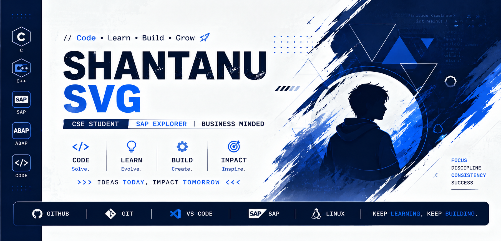

<p align="center">
  
</p>

<p align="center">
  
</p>

---

## 👨‍💻 About Me

I'm a Computer Science & Engineering student interested in
technology, problem solving, and building useful solutions.

- 💻 Working with **C, C++ & ABAP**
- 🏢 Currently exploring **SAP & Business Management**
- 🚀 Participating in **Hackathons & Team Projects**
- 🧠 Interested in software development and logical problem solving
- 🌱 Continuously learning and improving
- 💡 Exploring how technology can create practical solutions

---

## 🛠️ Tech Stack

### 💻 Programming Languages

<p>
  
</p>

### 🏢 SAP & Development

<p>
  
  
</p>

### ⚙️ Tools

<p>
  
</p>

---

## 🔎 Currently Exploring

- 🏢 **SAP & Business Management**
- 🧩 **ABAP Development**
- 💻 **Software Development**
- 🧠 **Problem Solving & DSA**
- 🤝 **Team Collaboration**
- 🏆 **Hackathons & Innovation**

---

## 🏆 Hackathons & Events

Currently working on hackathon ideas and collaborative projects.

- 🚀 Exploring real-world problem statements
- 🤝 Collaborating with teammates
- 💻 Building and testing solutions
- 🌱 Learning through hands-on experience

> 🚧 Hackathon projects are currently in progress.

---

## 🚀 Featured Projects

> 🚧 Projects are currently under development.
>
> Completed projects will be featured here soon.

---

## 📊 GitHub Activity

<p align="center">
  
  
</p>

---


## 🎯 Learning Philosophy

```text
Think
  ↓
Learn
  ↓
Experiment
  ↓
Build
  ↓
Collaborate
  ↓
Improve
